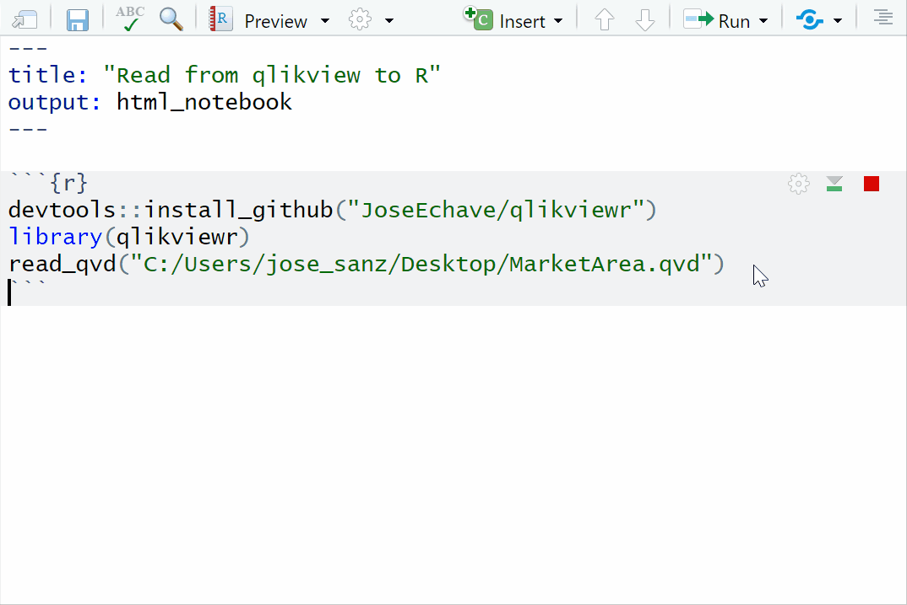

# qlikviewr
Run qlikview from R and load qvd data

We use qlikview at work, so I created this package so that my workflows are reproducible (and potentially automated) all within R.

Works by sending CMD command lines to qlikview. It then passes variables defined in R to qlikview.

With this we could do many things. In this case, there are two functions:

reload_qvw: It opens the choosen qvw document, reloads the data and closes qlikview. Useful when your analysis is coming from data exported from qlikview.

read_qvd: It opens a qvw document inside the package, which has two variables (qvd path and path for the exported csv) which then is read into r as data frame through read_csv()

Note that qlikview license is needed to open qvw created by another user.

